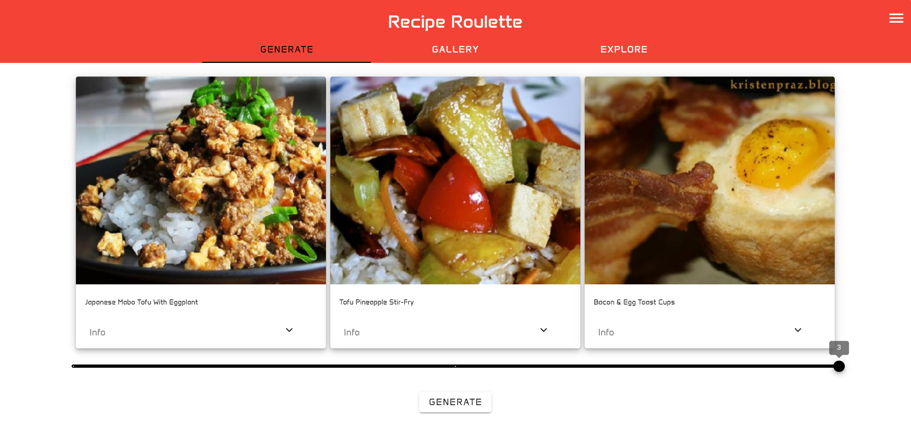

## About

The Recipe Roulette app is designed to create an ongoing, thrilling, and surprising experience through its random recipe generator, hence the name “Recipe Roulette”. Each recipe within the app allows you to view it’s title, in-depth instructions, description, and dietary restrictions. Moreover, one will also be able to add a recipe to their very own custom list. For first time users, they could create an account, and with this account includes a unique custom list of recipes and profile section of their very own. Every recipe card will contain a button that allows them to save a recipe into this list to their account for later viewing. In addition, three major sections are present: Generate, Gallery, Explore. 

The Generate section will allow a person to press a button and generate a random recipe with each click. There is also a slider that allows them to generate more than one recipe at a time, up to four recipes for quicker suggestions. The Gallery section is unique because for every time a person loads into the tab, a new selection of recipes will be present, making every experience one of a kind. To add on, the user will be able to filter recipes that suit their dietary restrictions. Lastly, the Explore section allows those with more specific preferences to search for a recipe or ingredient of their own. Through use of the search bar, the user could type in ‘cake’ and selection of cake-like recipes will appear for the person. Some apps that exist that incorporate similar functionality would be ShuffleChef, Tomaito, and SuperCook. Thus, the idea of this app is to try and create something simpler, quicker, and more accessible that provides those with a higher incentive to create more homecooked meals. 

## Initial Setup

Install the latest version of Node.js here at [nodejs.org](https://nodejs.org/en/download/package-manager)!

## Front-End Application

### Frontend and Backend Interaction Sequence

### Starting the Server
1. Switch directory to my-app
2. Run <b>npm i</b> to install needed packages/libraries.
3. Run <b>npm run dev</b> to start Vue.js app
4. App should run on http://localhost:3000

### Tools/Resources Used for Frontend

<li>Font Awesome for supplying app with ready icons at [FontAwesome.com](https://fontawesome.com/icons)</li>

## Back-End

### Running the Server With Vue.js Application
1. Change directory to /apis
2. Execute command <b>npm i</b> to install dependencies
2. Execute command <b>node server.js</b>
3. Console should log hosted URL: http://localhost:5000

### Tools/Resources Used for SSR (Server-Side Rendering)

<li>Express.js to create and maintain server, develop and integrate APIs, and run code locally or external server [Express.js](https://expressjs.com/)</li>

## Author

- Elijah Dodson

